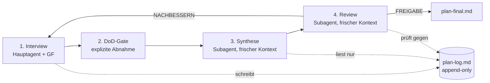

# CEO-Plan — KI-gestützte Strategie-Extraktion (EOS/Traction)

Ein Skill für KI-Agenten (Claude Code / Cowork), der den **impliziten Strategieplan eines Geschäftsführers aufs Papier holt** — durch ein hartnäckiges, sokratisches Interview, eine Frage nach der anderen. Aus dem protokollierten Gespräch erzeugt eine **Multi-Agenten-Kaskade** anschließend einen schriftlichen, unabhängig geprüften Unternehmensplan.

> Kurz gesagt: Viele inhabergeführte Unternehmen *haben* einen Plan — aber nur im Kopf des Gründers. Dieser Skill zwingt ihn ans Licht und macht ihn für die nächste Führungsebene nutzbar.

## Das Problem

Ein typisches Muster in wachsenden Unternehmen:

- Der Gründer ist **Visionär**, aber der **Integrator-Sitz** (operative Umsetzung) ist faktisch unbesetzt.
- Es gibt keine mittlere Ebene, weil **jede Entscheidung wieder beim Chef landet**.
- „Übernimm Verantwortung" heißt in der Praxis „übernimm Schuld" — weil Entscheidungs- und Finanzkompetenzen nie schriftlich definiert wurden.
- Einmal getroffene Entscheidungen werden **Wochen später informell wieder aufgemacht** und stoppen die Umsetzung.

Die Wurzel ist fast nie „faule Mitarbeiter", sondern **nicht ausgesprochene Erwartungen und nicht delegierte Entscheidungshoheit**.

## Was der Skill tut

Vier Stufen, bewusst in **drei frischen Kontexten** (gegen „Context Rot" — Qualitätsverlust langer LLM-Kontexte):



1. **Interview** — grillt den GF Frage für Frage durch das EOS/Traction-Framework und protokolliert jede Frage + Antwort sofort in ein append-only Logbuch (`plan-log.md`).
2. **DoD-Gate** — prüft eine harte „Definition of Done" und holt die **ausdrückliche Abnahme** des GF ein. Erst dann geht es weiter.
3. **Synthese-Subagent** — liest *nur* das Logbuch (kein Gesprächsgedächtnis) und destilliert daraus `plan-final.md`.
4. **Review-Subagent** — prüft den Plan unabhängig und kritisch gegen das Logbuch und dieselbe DoD (`plan-review.md`).

## Warum die Architektur so gebaut ist

- **Eine Frage pro Runde, keine Antwortempfehlungen.** Der Plan muss in den *eigenen Worten* des GF entstehen — ein abgenickter Plan wird später verleugnet, ein selbst formulierter nicht.
- **Sokratischer Modus**, wenn der GF ausweicht: zerlegen, am realen Fall konkretisieren, Schwellen von beiden Seiten einkreisen (z. B. Euro-Grenzen über einen „Zuviel-Fall" und einen „Bagatell-Fall").
- **Getrennte Kontexte** für Synthese und Review verhindern, dass das Modell aus dem Gesprächsverlauf Dinge „dazuerfindet", die nie gesagt wurden.
- **Verbindlichkeits-Layer** gegen das stille Wiederaufmachen: Entscheidungs-Steckbrief (Zahlen/Annahmen), Revisionstrigger (messbare Bedingung für Wiedervorlage) und eine Wiedereröffnungsregel.

## Methodische Grundlage

Inhaltlich entlang der sechs EOS-Komponenten aus ***Traction* von Gino Wickman**: Vision, Menschen/Struktur, Daten, Themen, Prozesse, Umsetzung — mit dem **Accountability Chart** als Rückgrat (wer besitzt welchen Sitz, mit welcher Entscheidungs- und Finanzkompetenz, welchem Budgetrahmen und welchem Prüfvorbehalt).

## Ergebnisartefakte

| Datei | Inhalt |
|---|---|
| `plan-log.md` | Quelle der Wahrheit — jede Frage + Antwort, append-only |
| `plan-final.md` | Plan inkl. Accountability Chart, Scorecard, Kernprozessen, 90-Tage-Rocks, Entscheidungsregister, Verbindlichkeitsklausel |
| `plan-review.md` | unabhängiger Prüfbericht (FREIGABE / NACHBESSERN) |

## Struktur dieses Repos

```
skill/
  SKILL.md              # Haupt-Skill: Interview-Kaskade, Phasen, DoD-Gate
  agents/
    synthesizer.md      # Auftrag des Synthese-Subagenten
    reviewer.md         # Auftrag des Review-Subagenten
examples/
  plan-log.example.md     # INPUT:  das protokollierte Interview (14 Runden)
  plan-final.example.md   # OUTPUT: der fertige Unternehmensplan
  plan-review.example.md  # QA:     unabhängiger Prüfbericht (FREIGABE/NACHBESSERN)
```

## Beispiel — Input → Output → QA

Ein durchgängiges, **frei erfundenes** Beispiel („Beispiel GmbH", ein Handwerks-SaaS-Anbieter) zeigt die komplette Kaskade:

1. **[`plan-log.example.md`](examples/plan-log.example.md)** — das *Interview*: 14 protokollierte Runden über alle EOS-Phasen, inkl. sokratischer Herausarbeitung einer Finanzkompetenz-Schwelle.
2. **[`plan-final.example.md`](examples/plan-final.example.md)** — der *Output*, und hier wird es operativ: vollständiges **Accountability Chart** (sechs Sitze mit Entscheidungs-/Finanzkompetenz, Prüfvorbehalt, Budgetrahmen), **Scorecard**, **Kernprozesse**, fünf **90-Tage-Rocks** mit Eigentümer + Datum, **Entscheidungsregister** mit Revisionstriggern und Verbindlichkeitsklausel.
3. **[`plan-review.example.md`](examples/plan-review.example.md)** — die *Qualitätssicherung*: ein unabhängiger Subagent prüft den Plan gegen das Logbuch und dieselbe Definition of Done — acht Prüfpunkte, dokumentiertes Verdikt.

So entsteht aus einem Gespräch ein Dokument, mit dem die nächste Führungsebene **am Montag arbeiten kann**: Wer entscheidet was, bis zu welchem Euro-Betrag, woran Erfolg gemessen wird und was in den nächsten 90 Tagen passiert.

> ⚠️ Echte Logbücher und Pläne enthalten vertrauliche Unternehmens- und Personendaten und gehören **niemals** in ein öffentliches Repository. Dieses Beispiel ist vollständig fiktiv.

## Quellen & Attribution

Dieser Skill steht auf den Schultern zweier Vorarbeiten — beide hier ausdrücklich genannt:

**Interview-Methodik — „Grill Me".**
Die Grundidee, den Nutzer hartnäckig und sokratisch *eine Frage nach der anderen* zu „grillen", bis implizites Wissen explizit wird, ist an den **„Grill Me"-Skill** angelehnt, der von **Matt Pocock** populär gemacht wurde ([aihero.dev: „My ‚Grill Me' Skill Went Viral"](https://www.aihero.dev/my-grill-me-skill-has-gone-viral)). Eine offene Implementierung der Idee: **[Jekudy/grillme-skill](https://github.com/Jekudy/grillme-skill)**.
Dieser Skill übernimmt das „eine Frage pro Runde"-Prinzip, weicht aber bewusst ab: **keine** Antwortempfehlungen, append-only Logbuch, EOS-spezifische Phasen und eine DoD-Gate-/Synthese-/Review-Kaskade.

**Inhaltliches Framework — Traction / EOS.**
Die sechs Komponenten (Vision, Menschen, Daten, Themen, Prozesse, Umsetzung) und das Accountability Chart stammen aus **„Traction: Get a Grip on Your Business"** von **Gino Wickman** (BenBella Books, 2011) und dem darauf aufbauenden **Entrepreneurial Operating System (EOS®)**.

**Rechtlicher Hinweis.**
Dieses Projekt ist eine **unabhängige, nicht-kommerzielle Umsetzung** und steht in **keiner Verbindung zu und wird nicht unterstützt von** EOS Worldwide, Gino Wickman oder Matt Pocock. „EOS" und „Traction" sind Marken bzw. Werke ihrer jeweiligen Rechteinhaber; die Nennung dient ausschließlich der Quellenangabe (nominative use). Es werden **keine geschützten Texte übernommen** — nur die frei nutzbaren methodischen Konzepte.

## Lizenz

[MIT](./LICENSE) © 2026 Julian Schorn

## Autor

**Julian Schorn** — KI-gestützte Führung & Organisation · Leadership + AI Transformation
LinkedIn: [in/julian-schorn](https://www.linkedin.com/in/julian-schorn)
